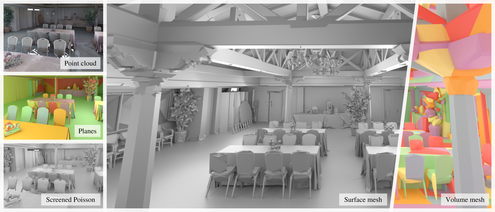

# Concise Plane Arrangements for Low-Poly Surface and Volume Modelling

[//]: # (One GIF of rotating bunny. Start with point cloud, detect polygons, insert polygon one by one in complex, extract decomposition, )
[//]: # (make it explode, put it back together and show concise surface. )


This repository contains the official implementation of the [arxiv paper "Concise Plane Arrangements for Low-Poly Surface and Volume Modelling"](https://arxiv.org/abs/2404.06154).
Given a set of input planes and corresponding inlier points the resulting plane arrangement can be used for polygon mesh reconstruction and convex decomposition. 

<p float="center">
  
</p>

# Features

- Reading of vertex groups ([.vg](https://abspy.readthedocs.io/en/latest/vertexgroup.html), .npz) as input (e.g. from [here](https://github.com/raphaelsulzer/psdr/tree/main))
- Fast and memory efficient concise plane arrangement construction
- Storing of the arrangement as a binary space partitioning tree (BSP-tree)
- Interior / exterior labelling of the arrangement cells using point normals or a reference surface mesh
- Further simplification of the arrangement based on a careful analysis of the BSP-tree 
- Extraction of a concise convex decomposition (i.e. interior cells of the arrangement), or a concise polygon surface mesh (i.e. interface polygons between interior and exterior cells). 

# Installation

Simply clone the repository and install in a new conda environment using pip:

```
git clone https://github.com/raphaelsulzer/compod.git
cd compod
conda create --name compod
conda activate compod
bash install.sh    # this step may take some time
pip install . 
```

You are now ready to use COMPOD.

### COMPOSE

COMPOSE is an extension for COMPOD that implements some routines for Surface Extraction in C++. Those are:
- a fast inside/outside labelling of the cells of the arrangement cells based on sampling points in a reference mesh. 
- a simplification of the surface extracted from COMPOD based on a Constrained Delaunay Triangulation of the corner vertices of each planar region of the surface mesh.

To install COMPOSE you need to follow the steps below:

```
cd compose
conda install -y -c conda-forge spdlog cgal anaconda::mpfr
pip install . 
```


# Usage

```
import os
from pycompod import VertexGroup, PolyhedralComplex

model = "anchor"

file = "../../../cpp/psdr/example/data/{}/convexes_detected/file.npz".format(model)
vg = VertexGroup(file,prioritise="area",verbosity=20)

cc = PolyhedralComplex(vg,device='gpu',logging_level=20)
cc.construct_partition()
cc.add_bounding_box_planes()
cc.label_partition(mesh_file="data/{}/dense_mesh/file.off".format(model),graph_cut=False,type="mesh")

os.makedirs("data/{}/partition".format(model),exist_ok=True)

cc.save_partition("data/{}/partition/file.ply".format(model), rand_colors=False,
                  export_boundary=True, with_primitive_id=False)

cc.simplify_partition_tree_based()
cc.simplify_partition_graph_based()

cc.save_partition_to_pickle("data/{}/partition".format(model))

cc.save_surface(out_file="data/{}/polygon_mesh_detected/file.ply".format(model), backend="cgal", triangulate=False)                          
```

# Examples

Please see the `example/` folder.

<p float="center">
  
</p>


# References

If you use this work please consider citing:

```bibtex
@misc{sulzer2024concise,
      title={Concise Plane Arrangements for Low-Poly Surface and Volume Modelling}, 
      author={Raphael Sulzer and Florent Lafarge},
      year={2024},
      eprint={2404.06154},
      archivePrefix={arXiv},
      primaryClass={cs.CG}
}
```
