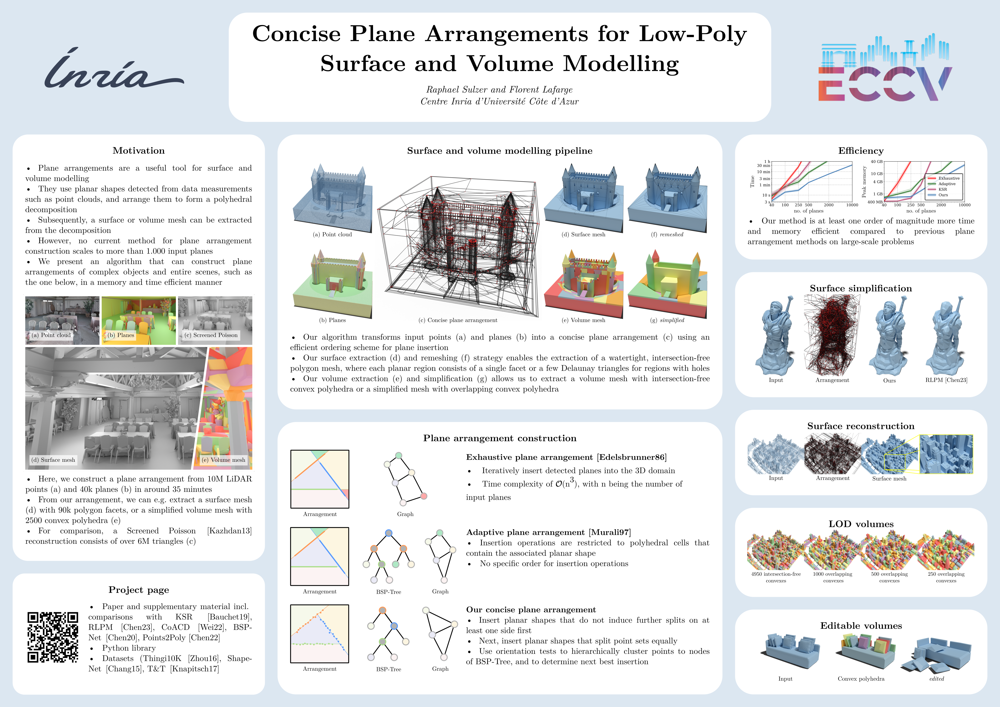

# Concise Plane Arrangements for Low-Poly Surface and Volume Modelling

[//]: # (One GIF of rotating bunny. Start with point cloud, detect polygons, insert polygon one by one in complex, extract decomposition, )
[//]: # (make it explode, put it back together and show concise surface. )


This repository contains the official implementation of the [ECCV 2024 paper "Concise Plane Arrangements for Low-Poly Surface and Volume Modelling"](https://arxiv.org/abs/2404.06154).
Given a set of input planes and corresponding inlier points the resulting plane arrangement can be used for polygon surface mesh reconstruction and convex decomposition of volumes. 

<p float="center">
  
</p>

# :clipboard: Features

- Reading of vertex groups ([.vg](https://abspy.readthedocs.io/en/latest/vertexgroup.html), .npz) as input (e.g. from [here](https://github.com/raphaelsulzer/psdr/tree/main))
- Fast and memory efficient concise plane arrangement construction
- Storing of the arrangement as a binary space partitioning tree (BSP-tree)
- Interior / exterior labelling of the arrangement cells using point normals or a reference mesh
- Further simplification of the arrangement based on a careful analysis of the BSP-tree 
- Extraction of a concise convex decomposition (i.e. interior cells of the arrangement)
- Extraction of a concise polygon surface mesh (i.e. interface polygons between interior and exterior cells). 

# :bricks: Installation

Clone the repository and install COMPOD as a python package in a new conda environment following the steps below:

```
git clone https://github.com/raphaelsulzer/compod.git
cd compod
sudo apt-get update && sudo apt-get install libgomp1 ffmpeg libsm6 libxext6 -y
bash install.sh    # this step may take some time
```

You are now ready to use COMPOD. You can test your installation with:

```
conda activate compod
python demo.py
```

### COMPOSE

COMPOSE is an extension for COMPOD that implements some routines for Surface Extraction in C++. Those are:
- Fast interior / exterior labelling of the arrangement cells based on interior point tests using a reference mesh. 
- Simplification of the extracted surface mesh based on a Constrained Delaunay Triangulation of the corner vertices of each planar region.

To install COMPOSE you need to follow the steps below:

```
conda activate compod # if not already active
cd compose
conda install -y conda-forge::spdlog conda-forge::cgal anaconda::mpfr
pip install . 
```

To test if the COMPOSE installation was successful run:

```
python -c "from pycompose import pdse, pdse_exact"
```

# :computer: Usage

```
from pycompod import VertexGroup, PolyhedralComplex

model = "anchor"

file = "data/{}/convexes_refined/file.npz".format(model)
vg = VertexGroup(file,verbosity=20)
cc = PolyhedralComplex(vg,device='gpu',verbosity=20)

cc.construct_partition()
cc.add_bounding_box_planes()
cc.label_partition(mode="normals")
# ## the following command needs the compose extension
# cc.label_partition(mode="mesh",mesh_file="data/{}/surface/dense_mesh.off".format(model))

cc.simplify_partition_tree_based()
cc.save_partition("data/{}/partition/tree_simplified_partition.ply".format(model), export_boundary=True)
cc.save_partition_to_pickle("data/{}/partition".format(model))

cc.save_in_cells(out_file="data/{}/volumes/volume_mesh.ply".format(model))
cc.save_surface(out_file="data/{}/surface/complex_mesh.obj".format(model), triangulate=False)
## the following commands need the compose extension
cc.save_simplified_surface(out_file="data/{}/surface/polygon_mesh.obj".format(model), triangulate=False)
cc.save_simplified_surface(out_file="data/{}/surface/triangle_mesh.obj".format(model), triangulate=True)  
cc.save_wireframe(out_file="data/{}/surface/wireframe.obj".format(model))         
```

[//]: # (# :camera_flash: Examples)

[//]: # ()
[//]: # (Please see the `data/` folder.)

[//]: # ()
[//]: # (<p float="center">)

[//]: # (  )

[//]: # (</p>)


# :book: Citation

If you use this work please consider citing:

```bibtex
@inproceedings{sulzer2024concise,
  title={Concise Plane Arrangements for Low-Poly Surface and Volume Modelling},
  author={Sulzer, Raphael and Lafarge, Florent},
  booktitle={European Conference on Computer Vision},
  pages={357--373},
  year={2024},
  organization={Springer}
}
```
